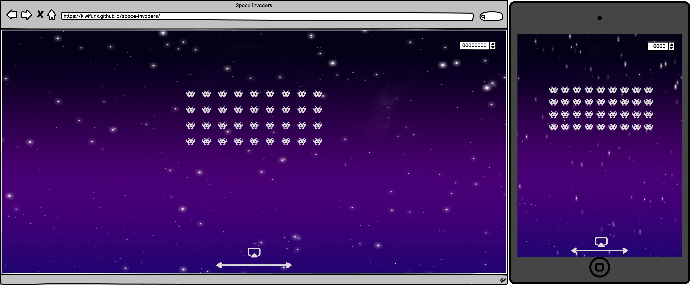

## Space Invaders

  

## Table of Contents
<ul>
	<a href="#about"><li>About The Project</li></a>
	<a href="#project-goals"><li>Project Goals</li></a>
	<a href="#technical-details"><li>Technical Details</li></a>
	<a href="#wireframes"><li>Wireframes</li></a>
	<a href="#ux-user-experience"><li>User Experience</li></a>
	<a href="#technologies-used"><li>Technologies Used</li></a>
	<a href="#testing"><li>Lighthouse Scores</li></a>
    <a href="#credits"><li>Credits</li></a>
	<a href="#ai-usage"><li>AI Usage</li></a>
</ul>

## About

For our hackathon, we have decided to recreate Space Invaders using HTML, CSS and JavaScript. We set out with the intention of creating a functional game that displays the essential pieces that make the game fun and playable.

## Project Goals

The goal of this project was to recreate an arcade aesthetic and replicate the basic mechanics of Space Invaders. We wanted to have waves of enemies that would respawn on round completion, getting more difficult with subsequent rounds, and a leaderboard and high score system on player death, like a traditional arcade machine would have. Our game should have traditional 8-bit graphics, and a UI and sound design to complement this. It should feel smooth and intuitive to play, with the ability to pause the game state, and controls to change things such as audio. Score, lives, and round number should all be tracked, and presented in a way that is easy for the player to read.

## Technical Details

The players and invaders in our game are all represented as objects constructed from classes. Each class holds data on the individual attributes of the entities, such as their health points (hp), sprites, and x/y positions. These classes also contain methods for performing various actions, including spawning, despawning, and performing health checks. This object-oriented approach allows for a modular and scalable design, making it easier to manage and extend the game.

When the game starts, invaders are initialized into a nested array structure, effectively creating a 2D array (in a normal programming language ;3). This structure simplifies the process of determining which invaders are eligible to fire. By identifying and returning the highest array index for each column of invaders, we can ensure that only the front facing invaders in each column can shoot, preventing any friendly fire incidents. In future updates we'd like to use this to generate other invader types as the rounds get harder to increase difficulty and add some variation. Invader sprites, hp, score value etc are all arguments that can be passed into the constructor making this very simple to achieve.

Our game loop makes use of delta time to make sure that it runs consistently across diffrent hardware, and make sure that functions are called consistently to prevent any game loop problems.

## Wireframes

# Main Menu

# Game Screen

# Instructions And Pause Menu

## UX (User Experience)
Initially, we input out project goals into GitHub Copilot and had it generate user stories that would relate to the creation of Space Invaders.

Our strategy for this ensured that we had a clear cut understanding of what a user would expect from a simple web-based application and we refined our results to match the scope of our project and timeframe.

After generating the <a href="#wireframes">wireframes</a> we set about to create our design visually (as shown above). We achieved a parralax effect that moves based on the cursor position for the main menu and overlayed a retro effect using gradients and an image of darkened screen corners that represent <abbr title="Cathode Ray Tube">CRT</abbr> monitors and arcade cabinets.

## Technologies Used

<ul>
    <a href="https://code.visualstudio.com/"><li>Visual Studio Code (VSC)</li></a>
    <a href="https://balsamiq.com/"><li>Balsamiq</li></a>
    <a href="https://slack.com/intl/en-gb/"><li>Slack</li></a>
</ul>

## Testing

 

## Credits

<a href="">Google Fonts</a>

## AI Usage

Being a 3 day hackathon project, with one of those days being spent on project planning and only a team of two people, Copilot proved useful for things such as proofreading code, and bugfixing, as well as searching the entire document for things such as syntax errors, or undeclared variables. Being able to do this in a few minutes instead of spending hours combing through the code proved invaluable in such a short time frame with a small team and limited resources.

Copilot also proved useful when refactoring parts of the code, as you could refactor a single list item, for example, and then ask copilot to format the rest of the entries in the same way. It also saved a lot of time googling or trying to find a specific function when you couldnt remember the exact name, or how it was supposed to be formatted.

Although it wasn't particularly useful for creating well optimized, useful code, it did save us a lot of time in the bugfixing process, and functioned like an additional teammember, making the whole proccess a lot less painful and stressful.